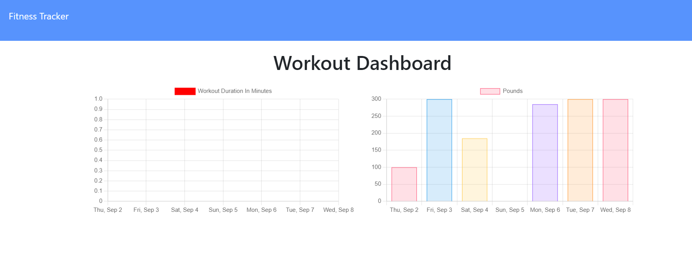

# Fitness Tracker

## Description
**Note:** application is only partially working currently.

This is a fitness tracker that allows users to track and get basic analytics from their previous workouts. It uses a NoSQL database and the Mongoose ORM.
  
--- 

## https://github.com/lancebailey26/workOutTracker
## https://young-everglades-00208.herokuapp.com/

--- 

## Installation

npm i in your terminal, set up a nosql database using provided seed files, and follow prompts after running the server.

--- 

## Usage

Input your workouts and then make use of the other tabs for basic analytics.

## Credits

n/a

## Copyright Lance Bailey 09/11/2021 License: MIT License